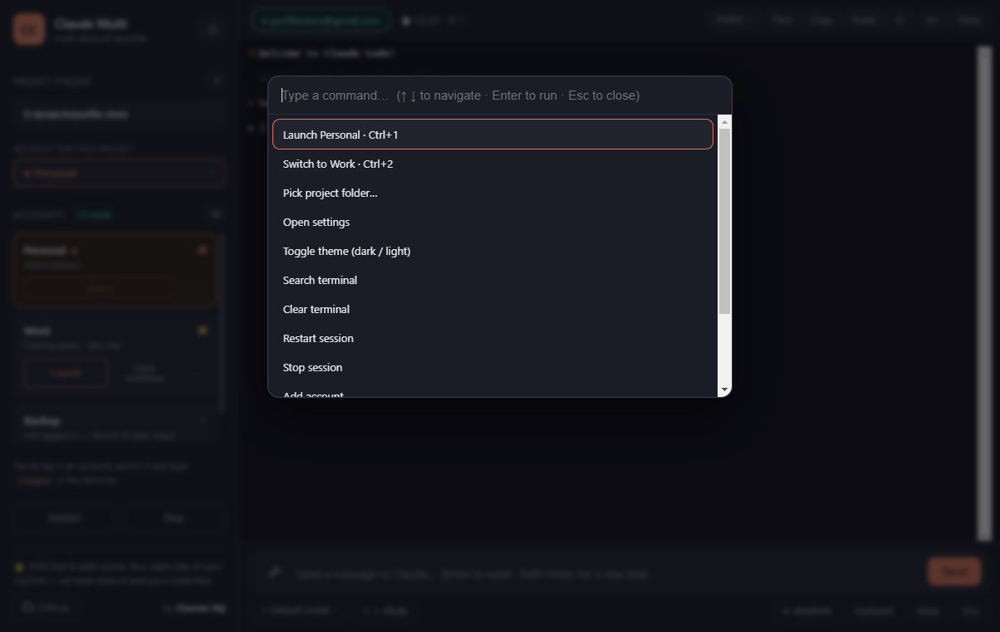

<div align="center">


# Claude Multi

**Run [Claude Code](https://claude.com/claude-code) with several accounts in one app — and switch automatically the moment one hits its usage limit.**

[](test)
[](LICENSE)


[](https://github.com/Chamanrajragu/claude-multi/releases/latest)

**A free, open-source desktop app (GUI) for Claude Code — manage up to 20 Claude accounts, pick an account per project, and auto-switch when you hit a usage limit. Runs entirely on your machine and never stores or sends your credentials.**

<sub>Keywords: Claude Code GUI · Claude Code desktop app · multiple Claude accounts · Claude usage limit / rate limit workaround · Anthropic · multi-account account switcher · Windows · macOS · Linux</sub>

<br/>


</div>

---

## ⬇️ Download

**[Get the latest Windows build →](https://github.com/Chamanrajragu/claude-multi/releases/latest)**

Grab `Claude-Multi-…-win-x64-portable.zip`, unzip it anywhere, and run **`Claude Multi.exe`** — no installer required. (You'll still need [Node.js](https://nodejs.org) and [Claude Code](https://claude.com/claude-code) installed.) Prefer to run from source? See [Quick start](#quick-start).

## Why?

If you pay for more than one Claude plan, you've felt this: you're deep in a session, you hit the usage limit, and everything stops for hours — even though you have *another* account sitting idle.

**Claude Multi** keeps all of your accounts in one window. When the active account runs out, it detects the limit, carries your conversation over to the next available account, and relaunches Claude Code with `--continue` so you barely lose a beat.

No credential hacking, nothing against the rules — each account simply gets its own isolated config directory (the officially supported `CLAUDE_CONFIG_DIR` mechanism). These are **your** paid accounts.

## Features

- 💬 **A polished chat bar, not a bare terminal** — a Claude Code–style composer at the bottom with a **model picker** (Opus / Sonnet / Haiku), a **mode** button (cycles permission modes), quick **presets** (ultrathink, `/compact`, `/clear`, Esc-to-interrupt), and a **🎤 voice/dictation** button. Type, hit Enter, done.
- 🎙️ **Voice input with no time limit** — the composer is a real text field, so OS dictation (Windows **Win+H** Voice Typing) works offline with **no ~1-minute cutoff**; browser speech is used automatically where available.
- 🧑‍🤝‍🧑 **Up to 20 accounts, fully isolated** — each account has its own login/config directory. No interference, no errors at scale.
- 📁 **A preferred account per project** — assign a specific Claude account to each project folder. Open project A → it uses account X; open project B → it uses account Y. Assignments are remembered per folder.
- ⭐ **Saved workspaces** — save a project folder + account as a named workspace and relaunch the pair with one click (or from the command palette).
- 🔄 **Auto-switch on limit** — detects "usage limit reached" in the terminal and rotates to the next available account. Manual "ask first" mode too.
- 💬 **Conversation carry-over** — copies the project's transcript to the new account and resumes with `claude --continue`.
- ⏳ **Cooldown tracking** — remembers when each account is rate-limited and when it resets, and skips accounts that are still cooling down (picking the one that frees up soonest if they're all down).
- 🖥️ **Real embedded terminal** — full xterm.js terminal with search, clickable links, copy/paste, adjustable font, and clear.
- 🔔 **Desktop notifications** when a limit is hit, an account switches, or a cooled-down account is **ready again**.
- 🎨 **Command palette** — `Ctrl/Cmd + P` to fuzzy-search every action (launch/switch accounts, pick project, settings, theme, and more).
- 🖥️ **System tray** — minimize to tray and quick-launch any account from the tray menu.
- ⌨️ **Quick-switch shortcuts** — `Ctrl/Cmd + 1…9` to launch or switch to an account instantly.
- 🗂️ **Reorder & color-tag accounts** — drag order via move up/down and assign color tags for quick visual ID.
- ↕️ **Prompt history** — press `↑` / `↓` in the chat bar to reuse recent prompts.
- 🔎 **Account filter** — a search box appears automatically once you have many accounts.
- 📝 **Session log export** — save the terminal transcript of a session to a `.log` file.
- ❓ **Shortcuts cheatsheet** — press `?` (or the footer button) for every keyboard shortcut at a glance.
- 📈 **Per-account usage stats** — sessions run and when each account was last used.
- 💾 **Backup & restore** — export/import your accounts & settings (no credentials included).
- 🔄 **Update checker** — tells you when a newer release is out.
- 🚀 **Start on login** (optional) and a **custom `claude` path**.
- ⚙️ **Settings** — auto-switch toggle + countdown, notifications, theme, extra launch flags.
- 📊 **Live status** — session timer, switch count, and a "ready accounts" indicator.
- 🌗 **Dark & light themes** with a clean, professional UI.
- 🎯 **Recent project folders**, per-account menus, and a friendly first-run guide.

## Why a desktop app instead of the raw terminal?

Claude Code is fantastic, but juggling several accounts in a bare terminal is painful: you log out and back in by hand, you lose your place when you hit a limit, and there's no way to say "this project uses that account." Claude Multi gives you a clean, good-looking window where every account is one click away, each project remembers its account, and hitting a limit just means clicking **Switch** — your conversation comes with you.

## Screenshots

<div align="center">

| Auto-switch on limit | Command palette (Ctrl/Cmd+P) |
| --- | --- |
|  |  |
| Settings | Light theme |
|  |  |

</div>

## How it works

```
┌─────────────────────────────┐
│  Electron app (main.js)      │
│  • account store + settings  │
│  • usage-limit scanner       │
│  • account switching         │
└──────────────┬──────────────┘
               │ newline-delimited JSON over stdio
┌──────────────▼──────────────┐        each account →
│  pty-host.js (plain Node)    │        its own CLAUDE_CONFIG_DIR
│  • owns the real PTY         │   ~/.claude-accounts/<id>/
│  • runs `claude` per account │
└─────────────────────────────┘
```

Each account launches `claude` with `CLAUDE_CONFIG_DIR` pointed at its own folder, so logins never collide. When the scanner sees a limit message, the current account is stamped with a cooldown (parsed from the reset time) and the switch flow begins.

## Requirements

- [Node.js](https://nodejs.org) 18+ (Node 20+ recommended)
- [Claude Code](https://claude.com/claude-code) installed and on your `PATH` (or point to it in Settings)

## Quick start

```bash
git clone https://github.com/Chamanrajragu/claude-multi.git
cd claude-multi
npm install
npm start
```

Then:

1. **Pick your project folder** (top-left) — the folder Claude Code will work in.
2. Click **+** to add an account (add up to 20), then **Launch** it.
3. Type `/login` in the terminal to sign that account in.
4. Repeat for each account.
5. *(Optional)* Use **Account for this project** to pin a specific account to the current folder. Each project remembers its own account.
6. When one account runs out, you'll be offered a switch — your conversation carries over automatically.

## Building installers

```bash
npm run dist        # build for your current OS into ./dist
npm run dist:win    # Windows (NSIS installer + portable .exe)
npm run dist:mac    # macOS (.dmg)
npm run dist:linux  # Linux (AppImage)
```

> The packaged app keeps `asar` disabled so the PTY host and its prebuilt native binary load cleanly, and it expects Node.js on the user's `PATH`. Running from source (`npm start`) is the most reliable path.

### Optional: GitHub Actions (CI + releases)

Ready-to-use workflows live in [`docs/github-workflows/`](docs/github-workflows/):

- `ci.yml` — runs `npm test` on every push / PR.
- `release.yml` — on a `vX.Y.Z` tag, builds installers for Windows, macOS, and Linux and attaches them to a GitHub Release.

To activate them, copy the files into `.github/workflows/` and push:

```bash
mkdir -p .github/workflows
cp docs/github-workflows/*.yml .github/workflows/
git add .github/workflows && git commit -m "Enable GitHub Actions" && git push
```

(Pushing files under `.github/workflows/` requires a token with the `workflow` scope — run `gh auth refresh -s workflow` once if needed.)

## Keyboard shortcuts

| Shortcut | Action |
| --- | --- |
| `Ctrl/Cmd + P` | Command palette (fuzzy-search all actions) |
| `Ctrl/Cmd + 1…9` | Launch / switch to the Nth account |
| `Enter` / `Shift+Enter` | Send message / new line (in the chat bar) |
| `↑` / `↓` | Reuse recent prompts (in the chat bar) |
| `Win + H` | Windows Voice Typing into the chat bar (offline, no time limit) |
| `Ctrl/Cmd + F` | Search the terminal |
| `Ctrl/Cmd + Shift + C` | Copy selection |
| `Ctrl/Cmd + Shift + V` | Paste |
| `Ctrl/Cmd + =` / `-` | Bigger / smaller text |
| `Ctrl/Cmd + K` | Clear terminal |
| `Ctrl/Cmd + ,` | Open settings |
| `?` | Keyboard shortcuts cheatsheet |

## Tests

```bash
npm test
```

The suite covers the pure logic — usage-limit detection, reset-time parsing, account selection/cooldown, and the persistent store — including thousands of fuzzed cases.

## Free & open source

Claude Multi is **completely free** and **open source (MIT)**. There is no paid tier, no account to create, no ads, and **no monetization of any kind** — the author earns nothing from it. Use it, fork it, and modify it however you like.

## Privacy — we never store your credentials

**Claude Multi does not collect, transmit, or store your Claude credentials — ever.**

- 🔒 **Logins are handled entirely by Claude Code**, inside each account's own local config folder (`~/.claude-accounts/<id>/`) on *your* machine. The app never reads, copies, or uploads your tokens.
- 🖥️ **Everything stays local.** The only data the app itself saves is your account *labels* and preferences, in Electron's `userData` folder on your computer. Nothing leaves your device.
- 📡 **Zero telemetry.** No analytics, no tracking, no phone-home, no external servers. The app talks only to your local `claude` process.
- 🚫 `.gitignore` excludes `accounts.json` and `.claude-accounts/`, so credentials can never be committed by accident.
- ✅ All it does is set the officially supported `CLAUDE_CONFIG_DIR` environment variable per account — exactly as documented by Claude Code.

Don't take our word for it — [the entire source is right here](src/) to read.

## Limitations

- A usage limit is enforced server-side, so a session can't be handed off mid-request. The switch ends the current session and resumes on the next account — near-seamless, not literally invisible.
- Limit-message wording can change over time; detection patterns live in [`src/limits.js`](src/limits.js) and are easy to extend.

## Author

Made by **Chaman Raj** — [github.com/Chamanrajragu](https://github.com/Chamanrajragu)

If this saved you from a mid-session usage wall, a ⭐ on the repo is appreciated!

## License

[MIT](LICENSE) © 2026 Chaman Raj

> Not affiliated with Anthropic. "Claude" and "Claude Code" are trademarks of Anthropic.
