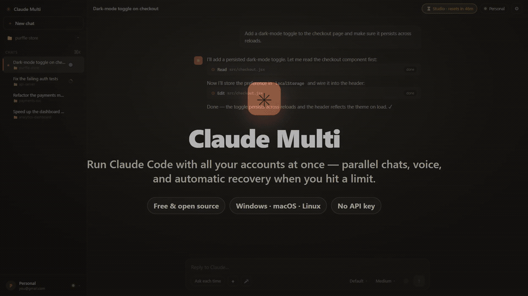
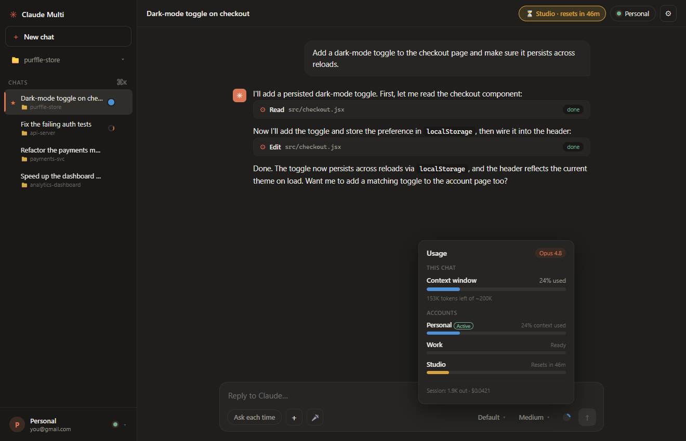
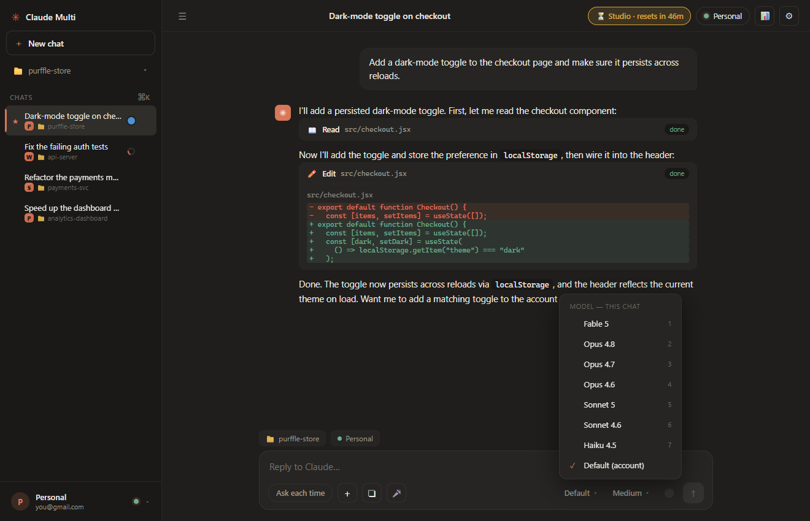
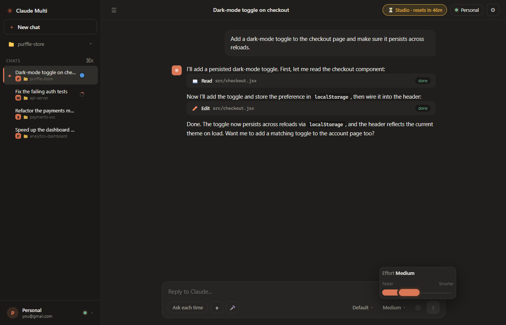
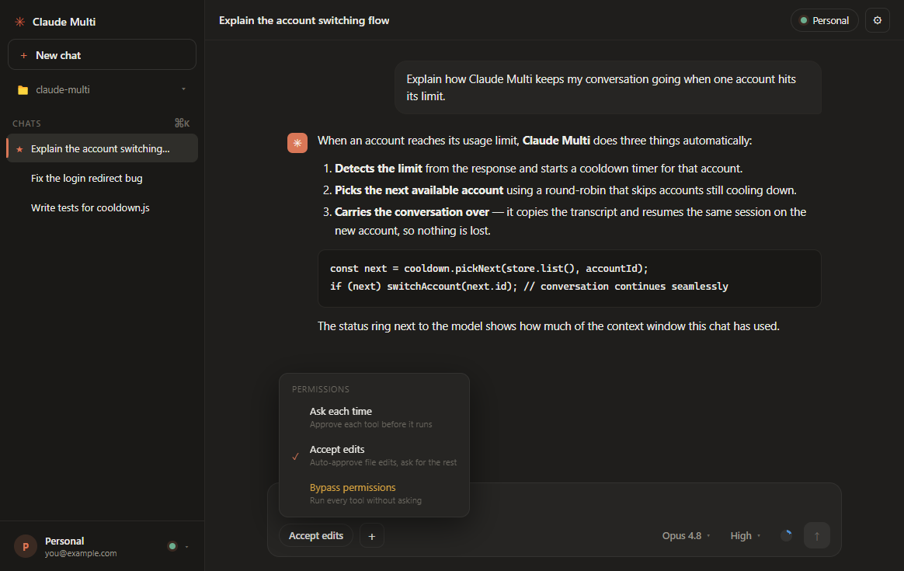

<div align="center">


# Claude Multi

**Run [Claude Code](https://claude.com/claude-code) with several accounts in one app — and switch automatically the moment one hits its usage limit.**

[](https://github.com/Chamanrajragu/claude-multi/releases/latest)
[](https://github.com/Chamanrajragu/claude-multi/releases)
[](https://github.com/Chamanrajragu/claude-multi/stargazers)
[](https://github.com/Chamanrajragu/claude-multi/commits/main)
[](LICENSE)

[](https://github.com/Chamanrajragu/claude-multi/releases/latest)

**A free, open-source desktop app (GUI) for Claude Code — manage up to 20 Claude accounts, pick an account per project, and auto-switch when you hit a usage limit. Runs entirely on your machine and never stores or sends your credentials.**

<sub>Keywords: Claude Code GUI · Claude Code desktop app · multiple Claude accounts · Claude usage limit / rate limit workaround · Anthropic · multi-account account switcher · Windows · macOS · Linux</sub>

<br/>


<br/>

### 🎬 See it in action



**▶️ [Watch the full 2-minute feature tour (with narration + sound)](https://github.com/Chamanrajragu/claude-multi/releases/download/v1.9.0/claude-multi-tour-1080p.mp4)**

</div>

---

## ⬇️ Download

**[Get the latest Windows build →](https://github.com/Chamanrajragu/claude-multi/releases/latest)**

Two options on the [Releases](https://github.com/Chamanrajragu/claude-multi/releases/latest) page:

- **Installer** — `Claude Multi Setup <version>.exe` — run it, choose a folder, get Start-menu and uninstall entries.
- **Portable** — `Claude Multi <version>.exe` — run it directly, no install.

You'll still need [Node.js](https://nodejs.org) and [Claude Code](https://claude.com/claude-code) installed. The build isn't code-signed yet, so Windows SmartScreen may show a prompt on first run — click **More info → Run anyway**. Prefer to run from source? See [Quick start](#quick-start).

## Why?

If you pay for more than one Claude plan, you've felt this: you're deep in a session, you hit the usage limit, and everything stops for hours — even though you have *another* account sitting idle.

**Claude Multi** keeps all of your accounts in one window. When the active account runs out, it detects the limit, carries your conversation over to the next available account, and continues it there — so you barely lose a beat.

No credential hacking, nothing against the rules — each account simply gets its own isolated config directory (the officially supported `CLAUDE_CONFIG_DIR` mechanism). These are **your** paid accounts.

## Features

- 🖥️ **Looks and feels like the Claude desktop app** — the same near-black interface, composer, model picker, effort slider, permission-mode pill, and a **usage panel** modeled on Claude's own "usage limits" view.
- 🧵 **Run many chats in parallel, each on its own folder** — start Claude on project A, then spin up a second chat pointed at project B and keep working while the first one runs. Each chat keeps its own folder and its own session; a live spinner in the sidebar shows which chats are busy.
- 🎤 **Voice to text** — a mic button in the composer lets you dictate a prompt instead of typing.
- ♻️ **Never lose work to a usage limit** — when an account hits its limit mid-task, Claude Multi carries the chat to another account **and automatically re-sends the interrupted instruction**, so the new account picks up exactly where the last one left off — no copy-pasting.
- ⏳ **Tokens left & reset countdown, always visible** — a top-bar pill shows when a rate-limited account frees up ("resets in 2h 14m"), alongside the context/token meter for the current chat.
- ⚡ **Built for flow** — **New chat** reuses the current folder instantly (Alt-click to pick another), **↑/↓ recalls your recent prompts**, **↻ Retry** regenerates the last response, **Esc** stops generation, **Duplicate** forks a chat, and the **sidebar is drag-to-resize**. Each chat shows a small **account badge** so you always know which account it's on.
- 🔔 **Never miss a background chat** — when a chat you're *not* looking at finishes or needs your approval, you get a desktop notification and a taskbar flash; the sidebar marks it with an amber dot, and the window title shows how many chats are working.
- 🧰 **Editor-grade touches** — **syntax-highlighted** code blocks, **Find in chat** (Ctrl/Cmd+Shift+F), **message timestamps**, **drag-to-reorder** chats, and a live **onboarding checklist** that ticks off as you get set up.
- 💬 **A real chat interface, not a terminal** — talk to Claude in a clean chat window: streamed markdown replies, collapsible **tool cards** (edits, commands, searches), and inline **Allow / Deny** prompts before Claude touches your files.
- 🛡️ **Permission modes** — keep the safe **Ask every time**, switch to **Auto-accept file edits**, or go hands-free with **Allow everything (no prompts)** — set it once in Settings → Chat.
- 📎 **Paste & drop attachments** — paste a screenshot or copied image straight into the composer (reads the image bytes directly, so it works even for images copied from a browser or file explorer), or drag files onto the window.
- 📊 **Live token meter** — a top-bar pill shows how much of the context window this chat has used and **how many tokens are left**; open it for a full breakdown (context used, cache reads, session output tokens and cost) plus the model actually running.
- 🔁 **One conversation, any account** — your chat belongs to the **project**, not the account. Switch accounts and the conversation is carried over and continues right where it left off; the full history stays visible when you switch back or reopen the app.
- 🔄 **Auto-switch on usage limit** — the moment an account hits its Claude usage/session limit, Claude Multi rotates to the next available account (or asks first). No more waiting hours for a reset when you have another account idle.
- ⏳ **Cooldown tracking** — remembers when each rate-limited account resets and skips accounts that are still cooling down, picking the one that frees up soonest.
- 🧑‍🤝‍🧑 **Multiple accounts, fully isolated** — every account gets its own login/config directory (`CLAUDE_CONFIG_DIR`). No interference, no logging in and out by hand.
- 🎛️ **Model + effort picker** — a Claude-desktop-style **Models** menu (**Fable 5, Opus 4.8 / 4.7 / 4.6, Sonnet 5 / 4.6, Haiku 4.5**) and a **Faster ↔ Smarter** effort slider, right in the composer or from the command palette.
- 🛂 **Permission-mode pill in the composer** — flip between **Ask each time**, **Accept edits**, and **Bypass permissions** (highlighted amber) without opening Settings.
- 📁 **A preferred account per project** — each project folder remembers which account it uses.
- 🔐 **Subscription login, no API key** — sign in each account once with your normal Claude subscription (Pro / Max / Team). Nothing is billed per token.
- 🔔 **Desktop notifications** when a limit is hit or an account switches.
- 🎨 **Themes that fit you** — dark, light, or **match your system**, plus adjustable **message width** and **text size**.
- ⌨️ **Command palette (Ctrl/Cmd + K)** — jump to any account, chat, or action; a built-in **shortcuts sheet** (Ctrl/Cmd + /) is one keystroke away.
- 📋 **One-click copy** — copy any assistant reply or individual **code block**, and **export a whole chat to Markdown**.
- 📌 **Pin & search chats** — keep important conversations at the top and filter the list instantly.
- ✨ **Starter prompts, drag-and-drop attachments, per-reply token/cost readout**, and a floating **scroll-to-latest** button.
- 🔒 **100% local** — no telemetry, no analytics, and your logins never leave your machine.

## Why a desktop app instead of the raw terminal?

Claude Code is fantastic, but juggling several accounts by hand is painful: you log out and back in, you lose your place when you hit a limit, and there's no way to say "this project uses that account." Claude Multi gives you a clean chat window where every account is one click away, each project remembers its account, and hitting a limit just rotates to the next account — your conversation comes with you.

## Screenshots

<div align="center">

| Usage panel (how many tokens left, per account) | Model selector |
| --- | --- |
|  |  |
| Effort slider (Faster ↔ Smarter) | Permission modes |
|  |  |
| Account switcher (Ctrl/Cmd + 1–9) | Auto-switch on limit |
|  |  |
| Settings | Light theme |
|  |  |

</div>

## How it works

Each account gets its own `CLAUDE_CONFIG_DIR` (`~/.claude-accounts/<id>/`), so their logins never collide. Chatting is powered by the official **Claude Agent SDK** using that account's **subscription** login — no API key. Signing in runs the real `claude` `/login` once per account in a small terminal window (the OAuth step can't run headless).

Every chat owns its **own folder** and its **own live session**, so you can run several at once without them interfering — start a task in one folder and, while it works, open another chat in a different folder and keep going. Transcripts are assembled in the main process, so chats running in the background still save their results.

When a reply comes back as a usage-limit error, the account is stamped with a cooldown (parsed from the reset time). If another account is free, Claude Multi copies the chat's transcript over, resumes the session, and **re-issues the instruction that was cut off** so the work continues on the new account automatically. If every account is cooling down, it tells you which one frees up soonest rather than bouncing between rate-limited accounts.

## Account safety & Anthropic's terms

**Please read this before you use it.** No spin — here's the honest picture.

**What this is (and isn't).** Claude Multi is for one person using **their own** Claude subscriptions. Each account is a separate plan you pay for, signed in through the normal `/login`, kept isolated with `CLAUDE_CONFIG_DIR`. It doesn't share, pool, resell, or crack accounts, and it doesn't raise any single account's limit — when one hits its cap you just continue on **another account you own**, with its own quota. This is very different from the account-stacking / reselling setups (e.g. someone running a dozen subscriptions) that Anthropic's abuse detection is built to catch.

**The part you need to weigh.** Around **February 2026 Anthropic tightened its Claude Code terms** to say that using the OAuth login from Free/Pro/Max accounts in **other tools — including the Agent SDK** — isn't permitted; it's meant for Claude Code and claude.ai only. They have server-side enforcement and reserve the right to act **without notice** (they softened this somewhat in April 2026 toward a pay-as-you-go model, but the direction is clear). Claude Multi drives the Agent SDK with your subscription login, so that policy **does apply to a tool like this** — regardless of the fact that the accounts are yours.

**So, honestly:**
- We're not affiliated with Anthropic and can't speak for how they enforce. This is **use-at-your-own-risk**, and we can't promise you won't be actioned.
- If you want zero risk, use **Claude Code / claude.ai as intended**, or **API-key billing** for anything custom.
- If you use this anyway: keep it to accounts that are genuinely **yours**, stay within each one's normal limits, and don't stack throwaway accounts to dodge limits.

Read the [Consumer Terms](https://www.anthropic.com/legal/consumer-terms) and [Usage Policy](https://www.anthropic.com/legal/aup) and decide for yourself.

## Requirements

- [Node.js](https://nodejs.org) 18+ (Node 20+ recommended)
- [Claude Code](https://claude.com/claude-code) installed and on your `PATH` (or point to it in Settings)

## Quick start

```bash
git clone https://github.com/Chamanrajragu/claude-multi.git
cd claude-multi
npm install
npm start
```

Then:

1. Click **New chat** and pick the **folder** for that chat — the folder Claude will work in.
2. Open the **account switcher** (bottom-left) → **Add account**.
3. Click **Log in** and sign in when your browser opens (paste the code back with **Ctrl+V**).
4. Repeat for each account.
5. Choose an account and start chatting. Start **another** chat in a different folder and they run side by side.
6. When an account runs out, Claude Multi carries the chat to a free account and continues the interrupted task automatically.

## Building installers

```bash
npm run dist        # build for your current OS into ./dist
npm run dist:win    # Windows (NSIS installer + portable .exe)
npm run dist:mac    # macOS (.dmg)
npm run dist:linux  # Linux (AppImage)
```

> The packaged app keeps `asar` disabled so the PTY host and its prebuilt native binary load cleanly, and it expects Node.js on the user's `PATH`. Running from source (`npm start`) is the most reliable path.

### Optional: GitHub Actions (CI + releases)

Ready-to-use workflows live in [`docs/github-workflows/`](docs/github-workflows/):

- `ci.yml` — runs `npm test` on every push / PR.
- `release.yml` — on a `vX.Y.Z` tag, builds installers for Windows, macOS, and Linux and attaches them to a GitHub Release.

To activate them, copy the files into `.github/workflows/` and push:

```bash
mkdir -p .github/workflows
cp docs/github-workflows/*.yml .github/workflows/
git add .github/workflows && git commit -m "Enable GitHub Actions" && git push
```

(Pushing files under `.github/workflows/` requires a token with the `workflow` scope — run `gh auth refresh -s workflow` once if needed.)

## Keyboard shortcuts

| Shortcut | Action |
| --- | --- |
| `Ctrl/Cmd + K` | Command palette (accounts, chats, actions) |
| `Ctrl/Cmd + /` | Keyboard shortcuts sheet |
| `Ctrl/Cmd + N` | New chat |
| `Ctrl/Cmd + F` | Search chats |
| `Ctrl/Cmd + 1…9` | Switch to the Nth account |
| `Enter` / `Shift + Enter` | Send message / new line (configurable in Settings) |
| `Ctrl/Cmd + V` | Paste (also into the login code box) |
| `Esc` | Close a dialog / the login window |

## Tests

```bash
npm test
```

The suite covers the pure logic — usage-limit detection, reset-time parsing, account selection/cooldown, and the persistent store — including thousands of fuzzed cases.

## FAQ

### How do I use multiple Claude accounts at once?
Install Claude Multi, add each account, and sign in once per account. Claude Multi keeps every account in a single window and lets you switch between them with one click — each account stays fully isolated in its own config directory, so there's no logging in and out by hand.

### How do I avoid hitting the Claude Code usage limit?
You can't raise a single account's limit, but if you have more than one Claude plan you can keep working by switching accounts. Claude Multi detects the moment an account hits its usage/session limit and automatically continues your conversation on the next available account, so you don't have to wait hours for a reset.

### Can I run two (or three) Claude accounts on the same computer?
Yes. Claude Multi is built for exactly this — run 2, 3, or more Claude accounts side by side, each isolated, and switch instantly. Your conversation carries over when you switch.

### Is this against Anthropic's terms? Is it a hack?
It's not a hack, and it's not account sharing or reselling — it's one person using their **own** paid subscriptions, each isolated via `CLAUDE_CONFIG_DIR`. But be aware: since **Feb 2026** Anthropic's terms restrict using a subscription (Pro/Max) login in third-party tools, including the Agent SDK — which is how a tool like this works — with enforcement possible without notice. So this is genuinely **use-at-your-own-risk**, and we can't guarantee against enforcement. Read the full, honest breakdown in [Account safety & Anthropic's terms](#account-safety--anthropics-terms) before you rely on it.

### Do I need an API key?
No. Claude Multi uses your normal Claude **subscription** login (Pro, Max, or Team) — the same one Claude Code uses. Nothing is billed per token.

### Does it work with Claude Pro and Claude Max?
Yes — any plan that works with Claude Code works here, including Pro, Max, Team, and Enterprise subscription logins.

### Is Claude Multi free?
Yes, 100% free and open source (MIT). No telemetry, no accounts on our side, and your logins never leave your machine.

### What platforms are supported?
Windows today (portable build). The app is built with Electron and the codebase targets macOS and Linux as well.

## Free & open source

Claude Multi is **completely free** and **open source (MIT)**. There is no paid tier, no account to create, no ads, and **no monetization of any kind** — the author earns nothing from it. Use it, fork it, and modify it however you like.

## 🔒 Your data & privacy

> **Summary:** Claude Multi is a **local-only** desktop application. It has **no servers, no developer-side accounts, and no way to see, collect, or receive your data.** Everything — your logins, your settings, and your entire chat history — is created and stored **on your own computer**. The author of Claude Multi never receives any of it.

This statement describes exactly how the application handles data. Because the project is open source (MIT), every claim below can be independently verified by reading the [source code](src/).

### 1. Credentials never reach us — or anyone
When you sign in to an account, authentication is performed by **Claude Code itself** through its normal `/login` (OAuth) flow. The resulting login is written by Claude Code into that account's **own local configuration directory** on your device (`~/.claude-accounts/<id>/`). Claude Multi does **not** read, copy, export, transmit, or otherwise handle your authentication tokens. It merely points Claude Code at the correct per-account folder using the officially documented `CLAUDE_CONFIG_DIR` environment variable.

### 2. All data is stored locally, on your machine only
Everything the application persists lives on **your** computer, in your operating-system user profile — never on any remote server:

| Data | Where it is stored | Contains credentials? |
| --- | --- | --- |
| Account logins (OAuth tokens) | `~/.claude-accounts/<id>/` (written by Claude Code) | Yes — **local only**, never touched by Claude Multi |
| Account labels & app settings | Electron `userData` folder (`accounts.json`) | **No** — names/preferences only |
| Chat history & transcripts | Electron `userData` folder | **No** — your conversations, kept on your device |

Nothing in the above is transmitted to the author or to any third party controlled by this project.

### 3. No telemetry, no analytics, no tracking
The application contains **no analytics, no tracking, no usage reporting, and no "phone-home" of any kind.** It makes **no outbound network requests of its own** — there is no update-checker beacon, no crash reporter, no server it talks to. Your Claude conversations travel only between your **local `claude` process and Anthropic**, exactly as they would if you used Claude Code directly; Claude Multi does not sit in the middle of, log, or forward that traffic. (Clicking a "GitHub" link simply opens the page in **your own browser** — the app itself connects to nothing.)

### 4. Single user, by design
Claude Multi is built for **one person using their own accounts on their own machine.** It provides no facility to share, sync, upload, export credentials, or make an account available to anyone else. If another person installs the app, their logins are created and stored on **their** computer — never yours, and never the author's.

### 5. Open source & auditable
There is no hidden behaviour to take on trust. The [entire source is public](src/); the network and file-system behaviour described here can be confirmed line by line.

> **Important — this is a privacy statement, not a compliance guarantee.** "Stored locally and private" is **not** the same as "permitted by Anthropic." How you access Anthropic's Services is governed by Anthropic's terms, and using a subscription login with automated tooling is a real consideration — please read [**Account safety & Anthropic's terms**](#account-safety--anthropics-terms) above and decide for yourself. This section only describes how *your data* is handled by *this app*.

## Limitations

- A usage limit is enforced server-side, so a session can't be handed off mid-request. The switch ends the current session and resumes on the next account — near-seamless, not literally invisible.
- Signing in still uses a small terminal window for the one-time `/login` per account (OAuth can't run headless); day-to-day chatting is a normal chat window.
- Limit detection reads the structured error the engine returns ([`src/chat.js`](src/chat.js)); wording can change over time but is easy to extend.

## Author

Made by **Chaman Raj** — [github.com/Chamanrajragu](https://github.com/Chamanrajragu)

If this saved you from a mid-session usage wall, a ⭐ on the repo is appreciated!

## License

[MIT](LICENSE) © 2026 Chaman Raj

> Not affiliated with Anthropic. "Claude" and "Claude Code" are trademarks of Anthropic.
