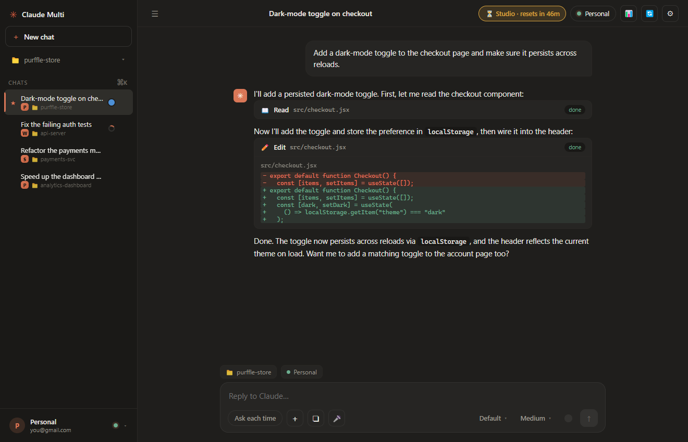
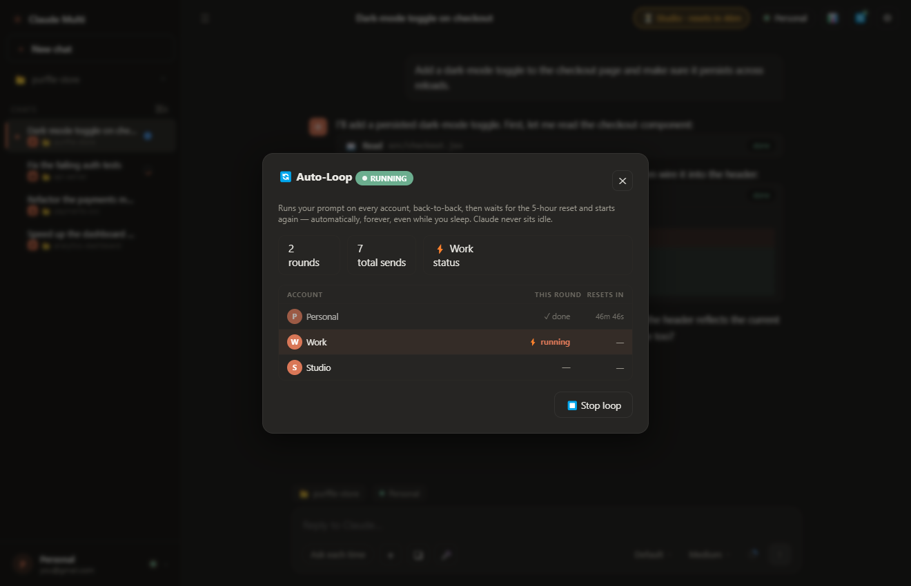
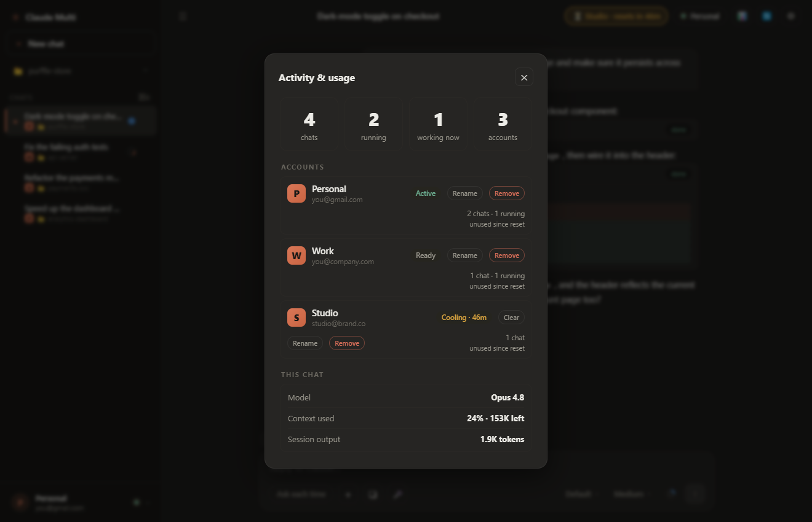
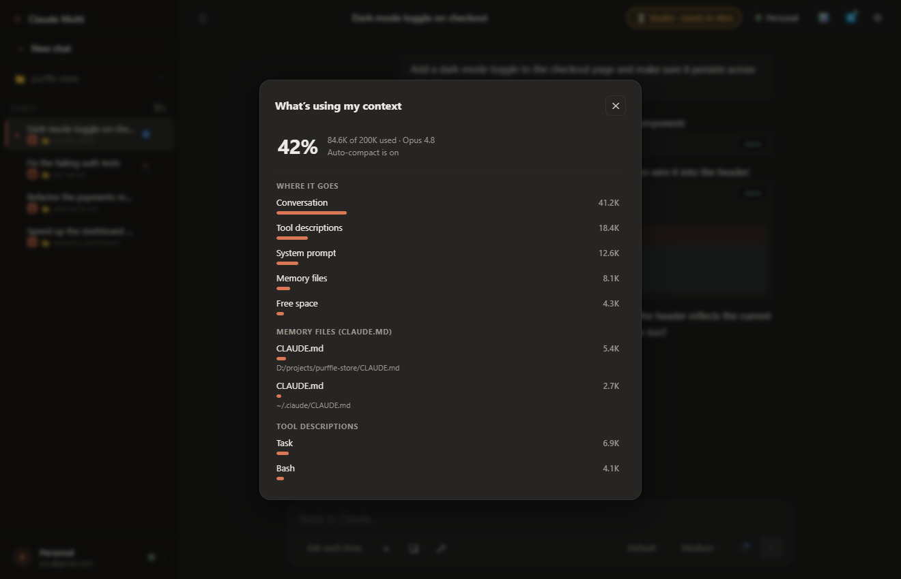
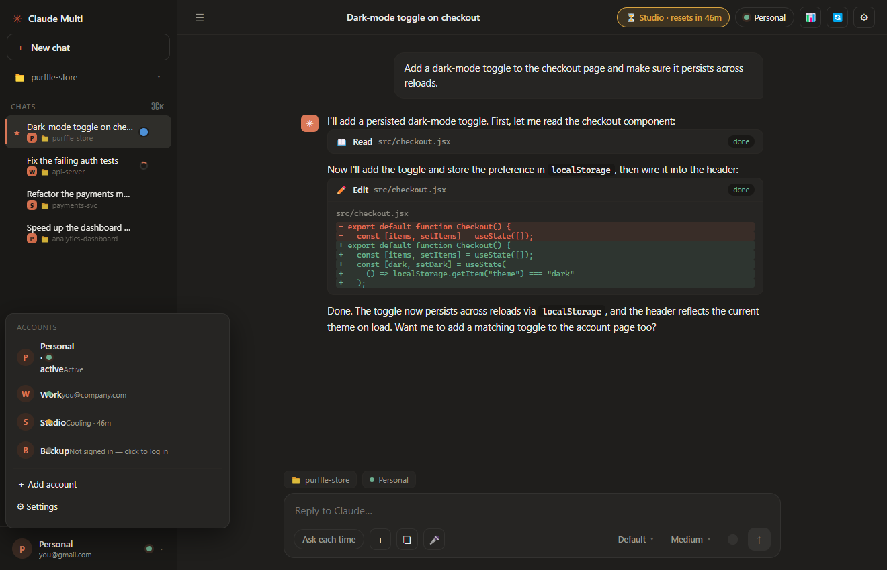
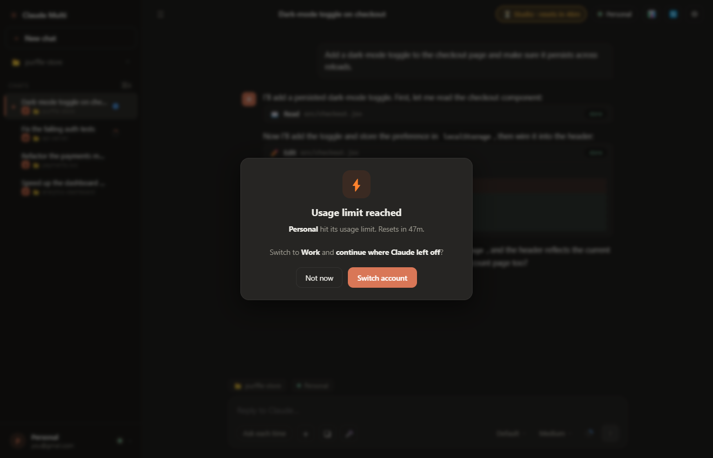
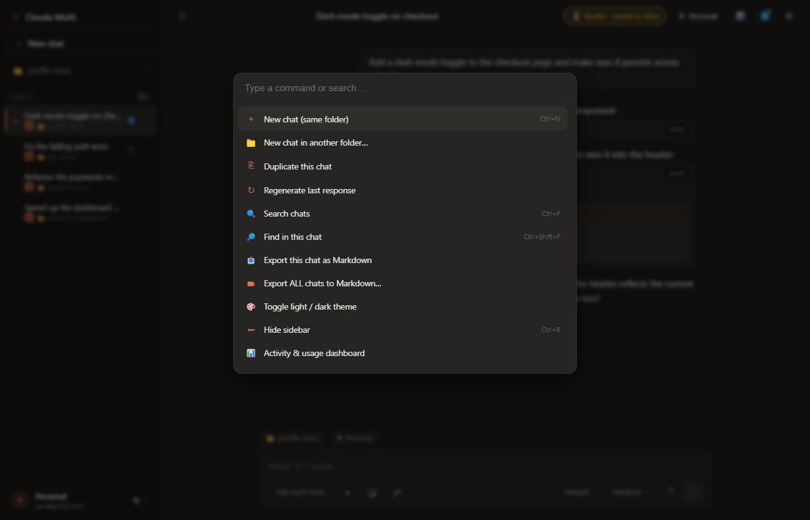
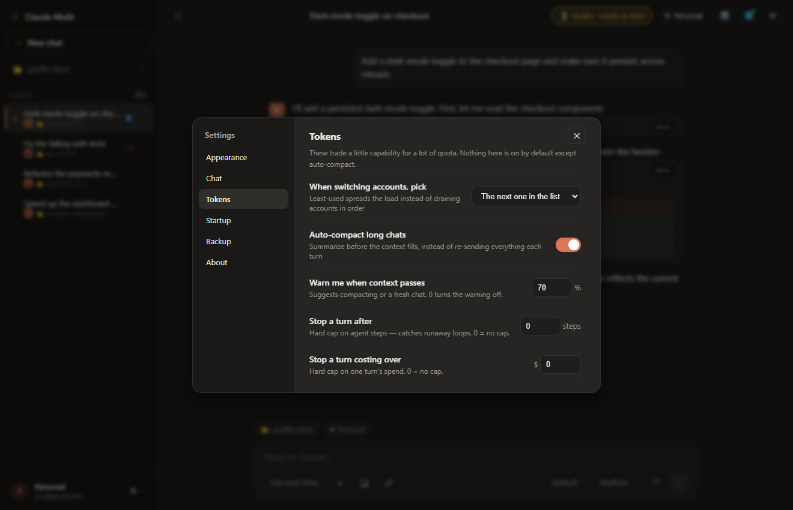
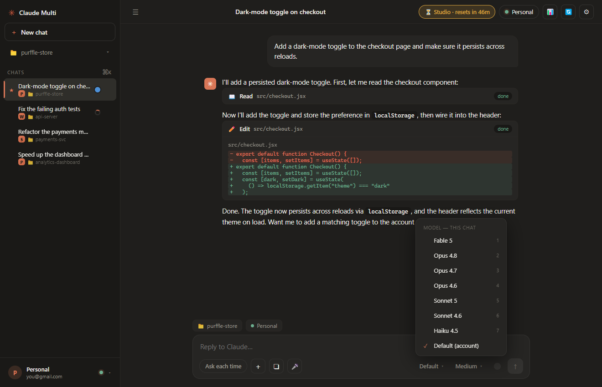
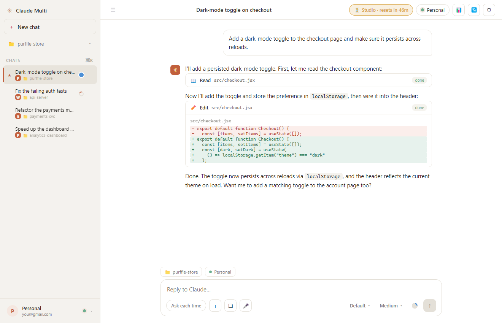

<div align="center">


# Claude Multi

### Run multiple Claude accounts in one window. Auto-switch when one hits its limit.

[](https://github.com/Chamanrajragu/claude-multi/releases/latest)
[](https://github.com/Chamanrajragu/claude-multi/releases)
[](https://github.com/Chamanrajragu/claude-multi/stargazers)
[](LICENSE)
[](#download)

**[🌐 claude-multi website](https://purffle.com/claude-multi/)** · **[⬇ Download Free for Windows](https://github.com/Chamanrajragu/claude-multi/releases/latest)** · **[macOS / Linux](https://github.com/Chamanrajragu/claude-multi/releases/latest)** · **[Quick Start](#quick-start)**

> ⭐ **If this saves you from a usage wall — please star the repo!** It helps others find Claude Multi when they search for it.

<br/>



*Claude Multi running on Windows — multiple accounts, live cooldown timers, streaming chat*

</div>

---

## What is Claude Multi?

**Claude Multi** is a **free, open-source desktop app** for Windows, macOS, and Linux that lets you run **[Claude Code](https://claude.com/claude-code) with multiple Claude accounts** — all in one window.

The core problem it solves: **Claude's 5-hour usage limit stops your work cold.** Claude Multi watches for that limit, instantly switches to your next available account, copies your conversation over, and **re-issues the interrupted instruction automatically** — so your task keeps running without you lifting a finger.

**Popular use cases:**
- 🔄 You have 2–5 Claude Pro/Max accounts and want to use them without switching browsers
- 🤖 You want Claude to work **24/7** on a long task while you sleep (Auto-loop)
- 💬 You want to run **parallel chats** on multiple projects simultaneously
- 📊 You want to see exactly what is consuming your Claude context and quota
- 🔋 You want to stretch your Claude subscription as far as possible

> **No API key required.** Works with your normal Claude subscription login. 100% local — no telemetry, no servers, your data never leaves your machine.

---

## 🆕 What's New in v1.30.4

- **💬 Answers like the Claude app** — replies now come back in the warm, thorough, well-formatted style of Claude Desktop, while keeping full Claude Code tools for hands-on tasks.
- **🎯 New chats just work** — a fresh chat inherits your last-used account, so your first message sends without an extra "pick an account" step.
- **🧰 Todo lists & subagents on** — the planning and fan-out tools Claude Code relies on for multi-step work are enabled.
- **🛠 No more silent failures** — if the chat engine stops before replying, you now see the actual error instead of nothing.
- **🧠 Full model line-up + five effort levels** — Fable 5, Opus 5, Opus 4.8/4.7/4.6, Sonnet 5/4.6, Haiku 4.5; Low → Max reasoning depth per chat.
- **🎤 Offline voice-to-text** — dictate into the composer with a bundled ~40MB speech model. Fully offline, no API key, 100% private.

> See the [full release notes](https://github.com/Chamanrajragu/claude-multi/releases/latest).

---

## Key Features

<table>
<tr>
<td width="50%">

**🔄 Auto-switch on usage limit**  
The moment an account hits its limit, Claude Multi switches to the next free account and continues your task — automatically, zero interruption.

**🤖 24/7 Auto-loop engine**  
Set a prompt once. Claude Multi sends it on every account in rotation, waits for the 5-hour reset, then repeats — indefinitely, even overnight.

**🧵 Parallel chats**  
Open multiple chats across different projects at the same time. Each runs independently with its own folder, account, and session.

**⏳ Live cooldown timers**  
Every account shows a live countdown — exactly how many hours and minutes until it resets. Updated every second.

</td>
<td width="50%">

**📊 Context inspector**  
See a full breakdown of your context window — every file, tool, memory item, and conversation turn — with exact token counts.

**🔎 @file autocomplete**  
Type `@` anywhere in the composer to fuzzy-search and insert any file from your project. Tab to complete, arrows to navigate.

**🧠 Every Claude model + 5 effort levels**  
Pick any model — Fable 5, Opus 5, Sonnet 5, Haiku 4.5 and more — and set reasoning from Low all the way up to **Ultra think** and **Max**, per chat.

**🎤 Offline voice-to-text**  
Dictate straight into the composer with a bundled speech model. No internet, no API key, no cloud — your voice never leaves your machine.

**🎨 Polished, familiar UI**  
Feels like the official Claude desktop app. Dark and light themes, accent colors, streamed markdown, syntax-highlighted code with language labels and copy buttons.

**🔒 100% private**  
No telemetry, no analytics, no update pings, no servers. Everything stays on your computer.

</td>
</tr>
</table>

---

## Download

> **Free. No account. No subscription. Just download and run.**

<div align="center">

| Platform | Direct download | Notes |
|----------|-----------------|-------|
| **Windows** | [⬇ Claude-Multi-Setup-1.30.7.exe](https://github.com/Chamanrajragu/claude-multi/releases/download/v1.30.7/Claude-Multi-Setup-1.30.7.exe) | Recommended — installs like any app |
| **Windows Portable** | [⬇ Claude-Multi-1.30.7.exe](https://github.com/Chamanrajragu/claude-multi/releases/download/v1.30.7/Claude-Multi-1.30.7.exe) | No install needed, run from anywhere |
| **macOS (Apple Silicon)** | [⬇ Claude-Multi-1.30.7-arm64.dmg](https://github.com/Chamanrajragu/claude-multi/releases/download/v1.30.7/Claude-Multi-1.30.7-arm64.dmg) | M1–M4 Macs |
| **macOS (Intel)** | [⬇ Claude-Multi-1.30.7.dmg](https://github.com/Chamanrajragu/claude-multi/releases/download/v1.30.7/Claude-Multi-1.30.7.dmg) | Intel-based Macs |
| **Linux** | [⬇ Claude-Multi-1.30.7.AppImage](https://github.com/Chamanrajragu/claude-multi/releases/download/v1.30.7/Claude-Multi-1.30.7.AppImage) | Works on most distros |

**Always-latest links:** [Windows installer](https://github.com/Chamanrajragu/claude-multi/releases/latest) · [all files & release notes](https://github.com/Chamanrajragu/claude-multi/releases/latest)

</div>

> **Windows SmartScreen warning:** The app is not code-signed yet. Click **More info → Run anyway**. The full source is open — [read it here](src/).

**Prerequisites:** [Node.js 18+](https://nodejs.org) and [Claude Code CLI](https://claude.com/claude-code) must be installed on your machine.

---

## Quick Start

**Option A — Installer** (2 minutes)

1. Download the installer from [Releases](https://github.com/Chamanrajragu/claude-multi/releases/latest)
2. Run it, follow the steps, open Claude Multi
3. Click **New chat** → pick your project folder
4. Open the **account switcher** (bottom-left) → **Add account** → **Log in**
5. Sign in when the browser opens — done ✓

**Option B — Run from source**

```bash
git clone https://github.com/Chamanrajragu/claude-multi.git
cd claude-multi
npm install
npm start
```

**Add more accounts:**  
Account switcher (bottom-left) → **Add account** → **Log in** → repeat for each Claude account.  
Claude Multi remembers which account to use per project folder.

---

## Full Feature List

### Multiple Claude Accounts — Seamless Switching
- Add up to **20 Claude accounts**, each fully isolated via `CLAUDE_CONFIG_DIR`
- **Auto-switch on usage limit** — re-issues your last instruction on the next account
- **One-click manual switch** with `Ctrl/Cmd + 1…9`
- Conversation transcript **carried over automatically** — no copy-pasting
- Per-project account memory — each folder remembers its preferred account
- Activity dashboard: every account's status, cooldown timer, and token usage
- Manual cooldown clear if needed

### 24/7 Auto-Loop — Run Claude While You Sleep
- Set a prompt once — Claude Multi runs it on all accounts in rotation, forever
- **Fresh chat per account per round** — context stays small and cheap
- Live per-account status table with round status and cooldown countdown
- Round counter, total sends, and wait-reason display
- **System tray integration** — see auto-loop status and stop it without opening the app

### Chat Experience
- **Parallel chats** — multiple projects open at once, each independent
- Real-time streamed markdown rendering
- **Syntax-highlighted code blocks** with language labels and one-click copy
- **Red/green diff view** for every file Claude edits
- Collapsible **tool cards** (📖 Read · ✏️ Edit · ⌨️ Bash · 🔍 Search · 🌐 Web)
- **Allow / Deny permission cards** before Claude modifies any file
- Thinking blocks in collapsible panels
- **Edit and resend** any previous message
- **Retry** to regenerate the last response
- `/compact` command to summarize the chat instantly

### Composer
- **Slash commands** — type `/` for `/new`, `/compact`, `/model`, `/switch`, `/copy` and more, without leaving the keyboard
- **@file autocomplete** — type `@` to fuzzy-search any file in your project
- **Voice to text (offline)** — mic button dictates straight into the composer using a bundled ~40MB speech model; no internet or API key required
- **Prompt templates** — save and reuse your best prompts
- **Paste images** directly — screenshots, browser images, any format
- **Drag and drop** files onto the window
- **Character counter** with warning at 8K characters
- **Prompt history** — Up/Down arrow to recall previous messages
- **Per-chat draft saving** — unsent text preserved when switching chats

### Token and Quota Management
- **Context inspector** (`Ctrl/Cmd + Shift + K`) — every item with token counts
- **Live token meter** — percentage used and tokens remaining, always visible
- **Auto-compact** — summarizes before the context overflows
- **Long-chat warning** — nudges you to compact or start fresh
- **Budget caps** — stop a turn after N steps or $X spend
- **Disable unused tools** — subagents, web search, fetch, todos, notebooks
- **Every current model** — Fable 5, Opus 5, Opus 4.8/4.7/4.6, Sonnet 5/4.6, Haiku 4.5
- **Five effort levels** — Low, Medium, High, Ultra think (xhigh), Max — set per chat
- **Per-chat model and effort** — Opus for hard tasks, Haiku for quick edits
- **Least-used account routing** — starts new tasks on the account with most quota

### Navigation and UI
- **Command palette** (`Ctrl/Cmd + K`) — every action and chat, instantly
- **Workspaces** — save a project folder paired with an account, then reopen the combo in one click
- **Global summon shortcut** — raise the window from any app, and press again to hide it
- **Full-text search** across all chats (`Ctrl/Cmd + F`)
- **Find in chat** (`Ctrl/Cmd + Shift + F`)
- **Drag-to-reorder** chats in the sidebar
- **Pin chats** to keep important ones at the top
- `Alt + ↑/↓` to move between chats
- **Recent projects** — right-click New Chat for instant folder switching
- Resizable sidebar
- **Zoom** (`Ctrl/Cmd + = / − / 0`)

### Reliability
- **Session auto-restart** — expired sessions detected and restarted with a toast notification
- **Undo delete** — a deleted chat can be restored from the toast before it is discarded
- **Background chat saving** — off-screen chats save correctly
- **Desktop notifications** when a chat finishes or needs your approval
- **Export to Markdown** — single chat or all chats at once, or copy one straight to the clipboard
- **Save any code block** to a file, with the extension picked from the fence language
- **Update check** — tells you when a newer release is published, and can be switched off
- **Backup and restore** — export/import your settings and account list

---

## Screenshots

<div align="center">

| Main chat | Auto-loop running 24/7 |
|:---:|:---:|
|  |  |

| Usage dashboard | What's using my context |
|:---:|:---:|
|  |  |

| Account switcher | Usage limit — carry the chat over |
|:---:|:---:|
|  |  |

| Command palette | Token settings |
|:---:|:---:|
|  |  |

| Model picker | Light theme |
|:---:|:---:|
|  |  |

</div>

---

## Keyboard Shortcuts

| Shortcut | Action |
|----------|--------|
| `Ctrl/Cmd + K` | Command palette |
| `Ctrl/Cmd + N` | New chat (same folder) |
| `Ctrl/Cmd + F` | Search all chats |
| `Ctrl/Cmd + Shift + F` | Find in this chat |
| `Ctrl/Cmd + Shift + K` | Context inspector |
| `Ctrl/Cmd + B` | Toggle sidebar |
| `Ctrl/Cmd + /` | Keyboard shortcuts reference |
| `Ctrl/Cmd + 1…9` | Switch to Nth account |
| `Alt + ↑ / ↓` | Previous / next chat |
| `Ctrl/Cmd + = / − / 0` | Zoom in / out / reset |
| `↑ / ↓` in empty composer | Recall previous prompts |
| `Enter` | Send message |
| `Shift + Enter` | New line |
| `Esc` | Stop generation / close dialog |
| `/compact` | Compact this chat |

---

## How It Works

Each account gets its own `~/.claude-accounts/<id>/` directory — the officially documented `CLAUDE_CONFIG_DIR` mechanism — so logins, sessions, and settings never collide.

Chats run through the **official Claude Agent SDK** (`@anthropic-ai/claude-agent-sdk`) using your **existing subscription login**. The first-time sign-in opens `claude /login` in a small terminal window (OAuth requires an interactive session). After that, everything runs silently in the background.

**The auto-switch flow, step by step:**

```
Your task is running on Account A
       ↓
Account A hits usage limit
       ↓
Claude Multi detects the limit error in the stream
       ↓
Account A stamped with cooldown (reset time from server response)
       ↓
Account B is free → transcript copied → session resumed with --resume
       ↓
Your interrupted instruction re-issued on Account B
       ↓
Task continues — you see a brief "switched to Account B" toast
```

---

## Making Your Claude Quota Last Longer

Every turn re-sends the full context — conversation history + CLAUDE.md + tool descriptions. Claude Multi gives you fine-grained control to slash token waste:

| What to do | Where | Why it helps |
|-----------|--------|-------------|
| Run `/compact` | Composer | Summarizes history, drops reasoning traces |
| Set effort to **Low** | Effort slider | Disables extended thinking — biggest per-turn saving |
| **Disable Subagents** | Settings → Tokens | Subagents multiply token usage fast |
| Set a **budget cap** | Settings → Tokens | Stops a runaway loop before it burns your quota |
| Open **Context inspector** | `Ctrl + Shift + K` | See exactly what is costing you |
| Switch to **Haiku** for quick edits | Model picker | Small fraction of Opus cost |
| **New chat** for new topics | New Chat button | Old context does not carry over |

---

## Account Safety and Terms

Claude Multi is built for **one person using their own accounts** — not sharing, pooling, or reselling access.

Each account authenticates with its own normal subscription login and stays within its own quota. The `CLAUDE_CONFIG_DIR` mechanism is officially documented by Anthropic.

**Important caveat:** Since February 2026, Anthropic's terms of service restrict using Pro/Max subscription credentials in third-party tools (including the Agent SDK). Claude Multi does exactly that. Account restrictions can happen without warning.

**The honest summary:** this is use-at-your-own-risk. If you want zero risk, use Claude Code or claude.ai directly. Read [Anthropic's terms](https://www.anthropic.com/legal/consumer-terms) before deciding.

---

## Privacy — What Claude Multi Does NOT Do

Everything is verified in the [open source code](src/):

- ❌ No telemetry
- ❌ No analytics
- ❌ No crash reporting
- ❌ No update pings
- ❌ No outbound network requests from the app itself
- ✅ Conversations go only between your local `claude` process and Anthropic's servers
- ✅ OAuth tokens are written by Claude Code locally — Claude Multi never reads or transmits them
- ✅ All data stays in Electron's local `userData` folder on your machine

---

## Build from Source

```bash
# Install dependencies
npm install

# Development mode (live reload)
npm start

# Build distributable for your current platform
npm run dist

# Build for specific platforms
npm run dist:win      # Windows installer + portable .exe
npm run dist:mac      # macOS .dmg (must run on macOS)
npm run dist:linux    # Linux AppImage
```

**Creating a release** — tag it and GitHub Actions builds everything automatically:

```bash
git tag v1.X.0
git push --follow-tags
```

---

## Tests

```bash
npm test
```

Covers: usage-limit detection, reset-time parsing, account selection logic, cooldown math, and the account store — including thousands of fuzzed inputs.

---

## FAQ

**How do I use Claude with multiple accounts in one application?**  
Install Claude Multi, click **Add account** once per Claude subscription you own, and sign in to each. Every account gets its own isolated `CLAUDE_CONFIG_DIR`, so the logins never collide. Then just chat — when one account hits its limit, Claude Multi moves the conversation to a free account and re-sends the interrupted instruction. Full walkthrough: [Quick Start](#quick-start).

**What happens when Claude hits the 5-hour usage limit?**  
Claude Multi reads the limit message, parks that account with a live countdown to its real reset time, then switches to an account that is free right now — copying the transcript across and re-issuing the instruction that got cut off. Your task continues instead of starting over.

**Can I run two Claude accounts at the same time?**  
Yes. Each chat carries its own folder, its own account and its own session, so you can run several accounts in parallel on different projects simultaneously. Background chats keep working while you look at another one.

**Do I need a Claude API key?**  
No. Claude Multi uses your normal Claude Pro / Max / Team subscription login — the same one you use with Claude Code. No API key, no extra cost.

**Is Claude Multi free?**  
100% free and open source (MIT license). No paid tier, no account required, no ads, no upsells.

**What operating systems does it support?**  
Windows, macOS, and Linux.

**Is it against Anthropic's terms of service?**  
It is not account-sharing. But Anthropic's Feb 2026 terms restrict subscription logins in third-party tools. Use at your own risk — see [Account Safety](#account-safety-and-terms).

**How many Claude accounts can I add?**  
Up to 20 accounts.

**Why is Claude using so many tokens?**  
It is almost always the context window, not your prompts. Open the **Context Inspector** (`Ctrl/Cmd + Shift + K`) to see a breakdown. See [Making Your Claude Quota Last Longer](#making-your-claude-quota-last-longer).

**Can Claude Multi run tasks while I sleep?**  
Yes — that is what the **Auto-loop** feature is for. Set your prompt once and it runs on all accounts in rotation, waiting through resets, indefinitely.

**Does it work with Claude Code?**  
Yes — Claude Multi runs Claude Code in headless mode via the official Agent SDK. It is a GUI wrapper and multi-account manager for Claude Code.

**Can I use this if I only have one Claude account?**  
Yes. Single-account mode works fine — you still get parallel chats, the context inspector, @file autocomplete, the composer features, and everything else.

---

## Related Tools and Alternatives

- **[Claude Code](https://claude.com/claude-code)** — Anthropic's official CLI (Claude Multi is built on top of it)
- **[claude.ai](https://claude.ai)** — the official web interface
- Looking for **API-based** multi-account? Claude Multi uses subscription logins, not API keys

---

## Author

Built and maintained by **Chaman Raj** — [github.com/Chamanrajragu](https://github.com/Chamanrajragu)

Found a bug? [Open an issue](https://github.com/Chamanrajragu/claude-multi/issues).  
Have an idea? [Start a discussion](https://github.com/Chamanrajragu/claude-multi/discussions).

**If Claude Multi saved you from a usage wall — a ⭐ on this repo helps thousands of other people find it when they search for a solution. It takes 2 seconds and means a lot.**

---

## License

[MIT](LICENSE) © 2026 Chaman Raj

*Claude Multi is not affiliated with or endorsed by Anthropic. "Claude" and "Claude Code" are trademarks of Anthropic, PBC.*

---

<!-- 
SEO KEYWORDS — Claude Multi · claude multi download · claude multi app · claude multi accounts · Claude Code multiple accounts · Claude Code multi account · Claude Code GUI · Claude Code desktop app · run multiple Claude accounts · Claude usage limit fix · Claude usage limit workaround · Claude 5 hour limit · Claude rate limit bypass · Claude account switcher · multiple Claude subscriptions · Claude Code Windows app · Claude Code Mac app · Claude parallel chats · anthropic claude multi account · claude code auto switch · claude pro multi account · claude max multiple accounts · open source claude client · free claude desktop app · claude code electron · claudemulti · claude-multi github · how to use multiple claude accounts · claude code usage limit · claude code token saver · reduce claude token usage · claude context window · claude quota management · best claude code tool · claude code wrapper · claude code manager
-->
